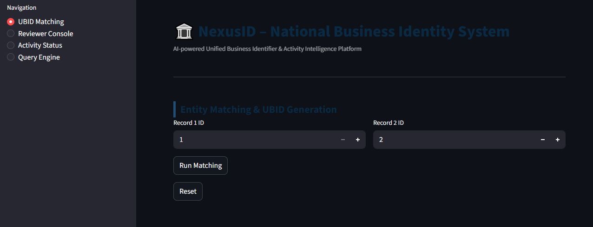
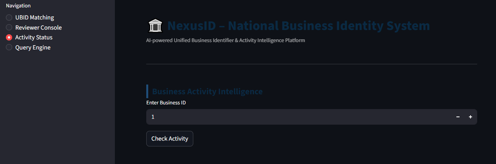
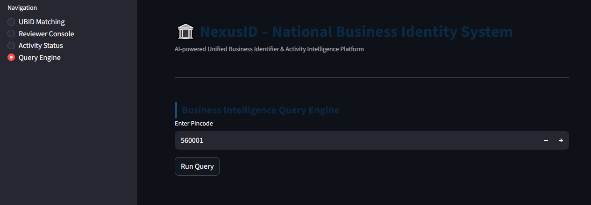

# 🏛️ NexusID – National Business Identity System

AI-powered Unified Business Identifier (UBID) & Business Activity Intelligence Platform.

NexusID is a governance-focused AI platform designed to solve duplicate business identity detection, business activity monitoring, and intelligent query analysis through explainable AI workflows.


# Features

## UBID Matching Engine
- AI-powered entity matching
- Confidence scoring
- Explainable matching decisions
- Automatic UBID generation
- Human review workflow support

## Reviewer Console
- Human-in-the-loop verification
- Match review & escalation
- Decision approval/rejection
- Audit-style review interface

## Activity Intelligence
- Detects:
  - Active businesses
  - Dormant businesses
  - Closed businesses
- Provides AI-generated explanations

## Query Engine
- Business intelligence lookup by pincode
- Issue identification
- Regional activity insights


## Tech Stack

| Layer | Technology |
|---|---|
| Frontend | Streamlit |
| Backend | FastAPI |
| AI Logic | Python |
| API Hosting | Render |
| Frontend Hosting | Streamlit Cloud |


## Application Screenshots
## UBID Matching




## Activity Status




## Query Engine




# Setup Instructions

## Clone Repository

```bash
git clone <your_repo_url>
cd NexusID-main
